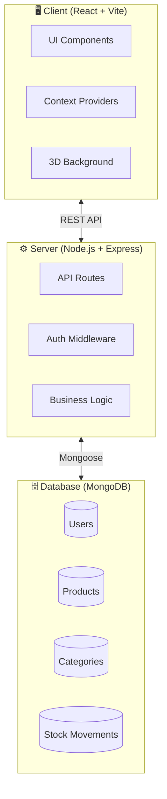
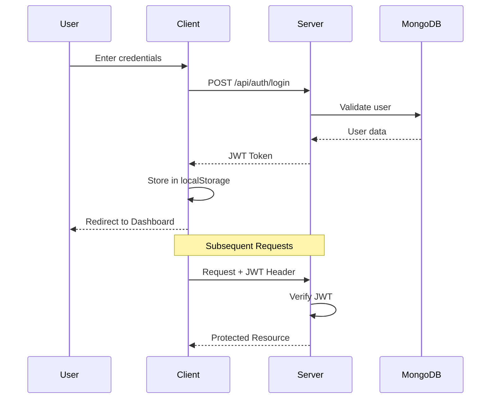
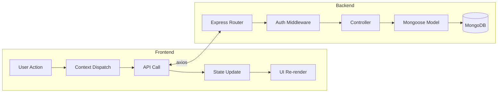
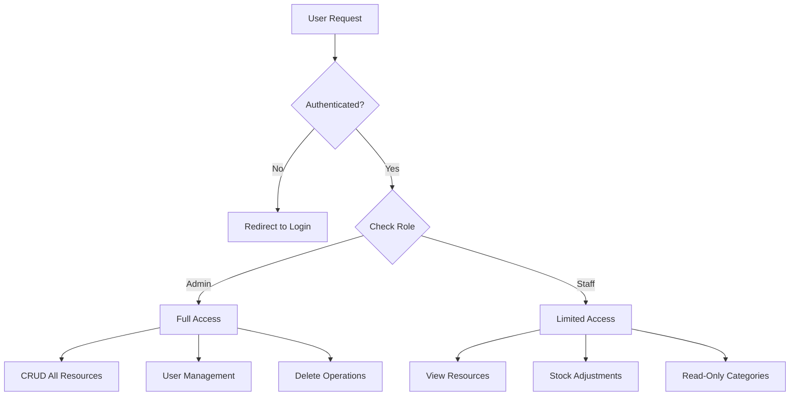
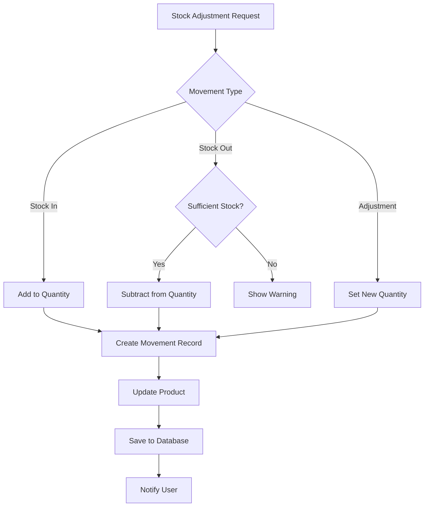
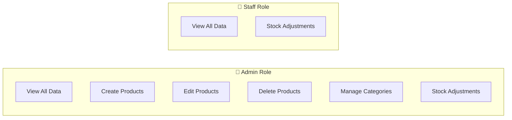

<div align="center">

# 🚀 TrackVerse

### Modern Inventory Management System

[](https://reactjs.org/)
[](https://nodejs.org/)
[](https://mongodb.com/)
[](https://tailwindcss.com/)
[](https://threejs.org/)
[](LICENSE)

*A futuristic, 3D-inspired SaaS dashboard for inventory management with glassmorphism UI, smooth animations, and real-time data synchronization.*

[Features](#-features) • [Demo](#-screenshots) • [Installation](#-installation) • [Architecture](#-architecture) • [API Reference](#-api-reference) • [Contributing](#-contributing)

</div>

---

## ✨ Features

### 🎨 Modern UI/UX
- **Glassmorphism Design** - Frosted glass effects with backdrop blur
- **3D Animated Background** - Floating geometric shapes, stars, and particles using Three.js
- **Smooth Animations** - Framer Motion powered transitions and micro-interactions
- **Responsive Design** - Mobile-first approach, works on all devices
- **Dark Theme** - Easy on the eyes, premium feel

### 📦 Inventory Management
- **Products** - Full CRUD operations with search, filter, and pagination
- **Categories** - Organize products with color-coded category cards
- **Stock Movements** - Track stock in/out/adjustments with audit trail
- **Low Stock Alerts** - Real-time notifications for inventory below threshold
- **Dashboard Analytics** - Key metrics at a glance with animated stat cards

### 🔐 Authentication & Security
- **JWT Authentication** - Secure token-based auth with auto-refresh
- **Role-Based Access Control** - Admin and Staff roles with different permissions
- **Self-Service Registration** - Users can register and select their role
- **Protected Routes** - Route-level security with role validation

### 🔄 Real-Time Features
- **Auto-Sync** - Data polling every 10 seconds for real-time updates
- **Toast Notifications** - Instant feedback for all user actions
- **Skeleton Loaders** - Smooth loading states

---

## 📸 Screenshots

<div align="center">

| Login Page | Dashboard |
|:---:|:---:|
| Glassmorphism login with 3D background | Animated stat cards with live data |

| Products | Stock Movements |
|:---:|:---:|
| Searchable product table with filters | Full audit trail with type badges |

</div>

---

## 🏗 Architecture

### System Overview



### Authentication Flow



### Data Flow



### Role-Based Access Control



### Stock Movement Flow



---

## 📁 Project Structure

```
TrackVerse/
├── project/
│   ├── backend/                    # Node.js/Express API
│   │   ├── config/
│   │   │   └── database.js         # MongoDB connection
│   │   ├── middleware/
│   │   │   ├── auth.js             # JWT & role verification
│   │   │   └── errorHandler.js     # Global error handling
│   │   ├── models/
│   │   │   ├── Category.js         # Category schema
│   │   │   ├── Product.js          # Product schema
│   │   │   ├── StockMovement.js    # Audit trail schema
│   │   │   └── User.js             # User schema with roles
│   │   ├── routes/
│   │   │   ├── auth.js             # Authentication endpoints
│   │   │   ├── categories.js       # Category CRUD
│   │   │   ├── dashboard.js        # Dashboard analytics
│   │   │   ├── products.js         # Product CRUD
│   │   │   └── stock.js            # Stock movements
│   │   └── server.js               # Express entry point
│   │
│   ├── src/                        # React Frontend
│   │   ├── components/
│   │   │   ├── ui/                 # Reusable UI components
│   │   │   │   ├── GlassCard.jsx
│   │   │   │   ├── GlassButton.jsx
│   │   │   │   ├── GlassInput.jsx
│   │   │   │   ├── GlassSelect.jsx
│   │   │   │   ├── GlassModal.jsx
│   │   │   │   ├── AnimatedCard.jsx
│   │   │   │   ├── SkeletonLoader.jsx
│   │   │   │   └── PageTransition.jsx
│   │   │   ├── three/              # 3D components
│   │   │   │   ├── Background3D.jsx
│   │   │   │   └── FloatingShapes.jsx
│   │   │   ├── Navbar.jsx
│   │   │   └── ProtectedRoute.jsx
│   │   ├── context/
│   │   │   ├── AuthContext.jsx     # Auth state management
│   │   │   └── InventoryContext.jsx # Inventory state
│   │   ├── pages/
│   │   │   ├── Login.jsx
│   │   │   ├── Register.jsx
│   │   │   ├── Dashboard.jsx
│   │   │   ├── Products.jsx
│   │   │   ├── Categories.jsx
│   │   │   └── StockMovements.jsx
│   │   ├── App.jsx                 # Root component
│   │   └── App.css                 # Global styles
│   │
│   ├── tailwind.config.js          # Tailwind configuration
│   ├── vite.config.js              # Vite configuration
│   └── package.json                # Frontend dependencies
│
└── README.md
```

---

## 🚀 Installation

### Prerequisites

- **Node.js** v18 or higher
- **npm** v9 or higher
- **MongoDB** (local installation or [MongoDB Atlas](https://www.mongodb.com/atlas) cloud account)
- **Git** for cloning the repository

### Step-by-Step Installation Guide

#### Step 1: Clone the Repository

```bash
git clone https://github.com/yourusername/TrackVerse.git
cd TrackVerse
```

#### Step 2: Install Frontend Dependencies

```bash
cd project
npm install
```

#### Step 3: Install Backend Dependencies

```bash
cd backend
npm install
cd ..
```

> **Or use the setup script (if available):**
> ```bash
> npm run setup
> ```

#### Step 4: Configure Environment Variables

Create a `.env` file inside the `backend` folder:

```bash
# Navigate to backend folder
cd backend

# Create .env file (Linux/Mac)
touch .env

# Or on Windows (PowerShell)
New-Item .env
```

Add the following content to `backend/.env`:

```env
# MongoDB Connection String
# For local MongoDB:
MONGODB_URI=mongodb://localhost:27017/trackverse

# For MongoDB Atlas (cloud):
# MONGODB_URI=mongodb+srv://<username>:<password>@cluster.xxxxx.mongodb.net/trackverse

# JWT Configuration
JWT_SECRET=your-super-secret-jwt-key-change-this-in-production
JWT_EXPIRE=30d

# Server Port
PORT=4000
```

#### Step 5: Start MongoDB (if using local installation)

```bash
# On Windows
mongod

# On Mac (with Homebrew)
brew services start mongodb-community

# On Linux
sudo systemctl start mongod
```

> **Using MongoDB Atlas?** Skip this step - your cloud database is always running.

#### Step 6: Start the Application

**Option A: Start Both Servers Together (Recommended)**

```bash
# From the project folder
cd project
npm run dev:all
```

**Option B: Start Servers Separately (Two Terminals)**

Terminal 1 - Backend:
```bash
cd TrackVerse/project/backend
npm run dev
```

Terminal 2 - Frontend:
```bash
cd TrackVerse/project
npm run dev
```

#### Step 7: Access the Application

| Service | URL | Description |
|---------|-----|-------------|
| 🌐 Frontend | http://localhost:5173 | Main application |
| ⚙️ Backend API | http://localhost:4000 | REST API server |
| 📊 API Health Check | http://localhost:4000/api | Verify backend is running |

#### Step 8: Create Your Account

1. Open http://localhost:5173 in your browser
2. Click **"Create one here"** or navigate to `/register`
3. Fill in your details
4. Select your role: **Staff** or **Administrator**
5. Click **Create Account**
6. Login with your credentials

---

### Quick Start (TL;DR)

```bash
# Clone and enter project
git clone https://github.com/yourusername/TrackVerse.git
cd TrackVerse/project

# Install all dependencies
npm install
cd backend && npm install && cd ..

# Create environment file
echo "MONGODB_URI=mongodb://localhost:27017/trackverse
JWT_SECRET=your-secret-key-here
JWT_EXPIRE=30d
PORT=4000" > backend/.env

# Start the application
npm run dev:all

# Open browser at http://localhost:5173
```

---

### Troubleshooting

| Issue | Solution |
|-------|----------|
| `ECONNREFUSED` error | Make sure MongoDB is running |
| Port 5173 in use | Kill the process or change port in `vite.config.js` |
| Port 4000 in use | Change `PORT` in `backend/.env` |
| Module not found | Run `npm install` in both `project` and `project/backend` folders |
| MongoDB Atlas connection fails | Check your IP is whitelisted in Atlas Network Access |

### Access URLs

| Service | URL |
|---------|-----|
| Frontend | http://localhost:5173 |
| Backend API | http://localhost:4000 |

---

## 👤 User Roles

### Creating an Admin Account

**Option 1: Self-Registration (Recommended)**
1. Navigate to `/register`
2. Fill in your details
3. Select **"Administrator"** as the account type
4. Submit and login

**Option 2: Manual Database Entry (Legacy)**
```bash
# Generate password hash
cd backend
node generateAdminHash.js

# Insert into MongoDB
{
  "name": "Admin User",
  "email": "admin@example.com",
  "password": "<hashed_password>",
  "role": "admin",
  "isActive": true
}
```

### Role Permissions Matrix



| Feature | Admin | Staff |
|---------|:-----:|:-----:|
| View Dashboard | ✅ | ✅ |
| View Products | ✅ | ✅ |
| Add/Edit Products | ✅ | ❌ |
| Delete Products | ✅ | ❌ |
| View Categories | ✅ | ✅ |
| Manage Categories | ✅ | ❌ |
| Stock Adjustments | ✅ | ✅ |
| View Stock History | ✅ | ✅ |

---

## 📡 API Reference

### Authentication Endpoints

| Method | Endpoint | Description | Auth |
|--------|----------|-------------|------|
| `POST` | `/api/auth/register` | Register new user | Public |
| `POST` | `/api/auth/login` | Login user | Public |
| `GET` | `/api/auth/me` | Get current user | Required |

### Product Endpoints

| Method | Endpoint | Description | Auth |
|--------|----------|-------------|------|
| `GET` | `/api/products` | List all products | Required |
| `POST` | `/api/products` | Create product | Admin |
| `GET` | `/api/products/:id` | Get single product | Required |
| `PUT` | `/api/products/:id` | Update product | Admin |
| `DELETE` | `/api/products/:id` | Delete product | Admin |

### Category Endpoints

| Method | Endpoint | Description | Auth |
|--------|----------|-------------|------|
| `GET` | `/api/categories` | List all categories | Required |
| `POST` | `/api/categories` | Create category | Admin |
| `PUT` | `/api/categories/:id` | Update category | Admin |
| `DELETE` | `/api/categories/:id` | Delete category | Admin |

### Stock Movement Endpoints

| Method | Endpoint | Description | Auth |
|--------|----------|-------------|------|
| `GET` | `/api/stock/movements` | List stock movements | Required |
| `POST` | `/api/stock/adjust` | Create adjustment | Required |

### Dashboard Endpoints

| Method | Endpoint | Description | Auth |
|--------|----------|-------------|------|
| `GET` | `/api/dashboard/stats` | Get statistics | Required |
| `GET` | `/api/dashboard/low-stock` | Get low stock items | Required |
| `GET` | `/api/dashboard/recent-activities` | Get recent movements | Required |

---

## 🛠 Tech Stack

### Frontend

| Technology | Version | Purpose |
|------------|---------|---------|
| React | 18.3.1 | UI Framework |
| Vite | 5.4.x | Build Tool |
| Tailwind CSS | 3.3.5 | Styling |
| Framer Motion | 11.x | Animations |
| Three.js | 0.160.0 | 3D Graphics |
| @react-three/fiber | 8.15.x | React Three.js Renderer |
| @react-three/drei | 9.88.x | Three.js Helpers |
| React Hot Toast | 2.x | Notifications |
| Axios | 1.6.x | HTTP Client |
| Lucide React | 0.400.x | Icons |

### Backend

| Technology | Version | Purpose |
|------------|---------|---------|
| Node.js | 18+ | Runtime |
| Express | 4.x | Web Framework |
| MongoDB | 6+ | Database |
| Mongoose | 8.x | ODM |
| JWT | 9.x | Authentication |
| bcryptjs | 2.x | Password Hashing |
| Helmet | 7.x | Security Headers |
| CORS | 2.x | Cross-Origin Support |

---

## 🎨 UI Components

### Glassmorphism Component Library

```jsx
import {
  GlassCard,
  GlassButton,
  GlassInput,
  GlassModal,
  AnimatedCard,
  SkeletonLoader
} from './components/ui';

// Glass Card with glow effect
<GlassCard blur="lg" glow hoverable>
  Your content here
</GlassCard>

// Animated button with icon
<GlassButton
  variant="primary"
  icon={Plus}
  loading={isLoading}
>
  Add Item
</GlassButton>

// Glass input with validation
<GlassInput
  label="Email"
  icon={Mail}
  type="email"
  error={errors.email}
  value={email}
  onChange={handleChange}
/>

// Animated modal
<GlassModal
  isOpen={isOpen}
  onClose={handleClose}
  title="Edit Product"
  size="lg"
>
  Modal content
</GlassModal>

// 3D tilt card
<AnimatedCard glowColor="purple" enableTilt>
  Card with 3D hover effect
</AnimatedCard>

// Skeleton loader
<SkeletonLoader variant="table" rows={5} columns={4} />
```

### Button Variants

| Variant | Description |
|---------|-------------|
| `primary` | Purple-pink gradient with glow |
| `secondary` | Glass background |
| `success` | Green gradient |
| `danger` | Red gradient |
| `ghost` | Transparent background |
| `outline` | Border only |

---

## 🔧 Configuration

### Tailwind Custom Theme

```javascript
// tailwind.config.js
{
  theme: {
    extend: {
      colors: {
        glass: {
          white: 'rgba(255, 255, 255, 0.1)',
          dark: 'rgba(0, 0, 0, 0.2)',
        },
        accent: {
          purple: '#8B5CF6',
          pink: '#EC4899',
          cyan: '#06B6D4',
        }
      },
      boxShadow: {
        'glass': '0 8px 32px rgba(31, 38, 135, 0.37)',
        'neon-purple': '0 0 20px rgba(139, 92, 246, 0.5)',
      },
      animation: {
        'float': 'float 6s ease-in-out infinite',
        'glow': 'glow 2s ease-in-out infinite alternate',
        'shimmer': 'shimmer 2s linear infinite',
      }
    }
  }
}
```

### Environment Variables

| Variable | Description | Required |
|----------|-------------|----------|
| `MONGODB_URI` | MongoDB connection string | Yes |
| `JWT_SECRET` | Secret key for JWT signing | Yes |
| `JWT_EXPIRE` | Token expiration (e.g., `30d`) | Yes |
| `PORT` | Backend server port | No (default: 4000) |

---

## 📜 Available Scripts

```bash
# Development
npm run dev          # Start frontend only
npm run dev:backend  # Start backend only
npm run dev:all      # Start both concurrently

# Build
npm run build        # Production build
npm run preview      # Preview production build

# Setup
npm run setup        # Install all dependencies
```

---

## 🧪 Testing

```bash
# Run frontend tests
npm run test

# Run backend tests
cd backend && npm test

# Run all tests
npm run test:all
```

---

## 🚀 Deployment

### Frontend (Vercel/Netlify)

```bash
npm run build
# Deploy the dist/ folder
```

### Backend (Railway/Render)

1. Set environment variables
2. Deploy from GitHub
3. Backend auto-deploys on push

### Docker

```dockerfile
# Coming soon
```

---

## 🤝 Contributing

1. **Fork** the repository
2. **Create** a feature branch (`git checkout -b feature/amazing-feature`)
3. **Commit** your changes (`git commit -m 'Add amazing feature'`)
4. **Push** to the branch (`git push origin feature/amazing-feature`)
5. **Open** a Pull Request

### Code Style

- Use ESLint configuration
- Follow React best practices
- Write meaningful commit messages
- Add comments for complex logic

---

## 📋 Roadmap

- [ ] Dark/Light theme toggle
- [ ] Export to CSV/PDF
- [ ] Barcode scanning
- [ ] Multi-warehouse support
- [ ] Email notifications
- [ ] Audit log viewer
- [ ] Mobile app (React Native)

---

## 🐛 Known Issues

- Large bundle size due to Three.js (consider code splitting)
- 3D background may impact performance on low-end devices

---

## 📄 License

This project is licensed under the **MIT License** - see the [LICENSE](LICENSE) file for details.

---

## 🙏 Acknowledgments

- [React](https://reactjs.org/) - UI Framework
- [Three.js](https://threejs.org/) - 3D Graphics
- [Tailwind CSS](https://tailwindcss.com/) - Styling
- [Framer Motion](https://www.framer.com/motion/) - Animations
- [Lucide Icons](https://lucide.dev/) - Icons

---

<div align="center">

**Built with ❤️ by TrackVerse Team**

[⬆ Back to Top](#-trackverse)

</div>
